# Entity Relationship Diagram (ERD) - TNA Management System

This document defines the data architecture for the Training Needs Analysis (TNA) system based on the PRD/SRS v1.1.

## Mermaid ER Diagram

```mermaid
erDiagram
    USER ||--o| EMPLOYEE : "is a"
    USER ||--o{ ROLE : "has"
    
    DEPARTMENT ||--o{ EMPLOYEE : "contains"
    DEPARTMENT ||--o{ POSITION : "defines"
    DEPARTMENT ||--o{ BUDGET : "owns"
    
    POSITION ||--o{ EMPLOYEE : "assigned to"
    POSITION ||--o{ POSITION_COMPETENCY : "requires"
    COMPETENCY ||--o{ POSITION_COMPETENCY : "is part of"
    
    EMPLOYEE ||--o{ ASSESSMENT_RESULT : "completes"
    ASSESSMENT ||--o{ ASSESSMENT_QUESTION : "contains"
    ASSESSMENT_QUESTION ||--o{ ASSESSMENT_RESPONSE : "answered by"
    EMPLOYEE ||--o{ ASSESSMENT_RESPONSE : "provides"
    ASSESSMENT_RESULT ||--o{ ASSESSMENT_RESPONSE : "aggregates"
    
    EMPLOYEE ||--o{ TRAINING_REQUEST : "submits"
    TRAINING_REQUEST ||--o{ TRAINING_REQUEST_APPROVAL : "goes through"
    USER ||--o{ TRAINING_REQUEST_APPROVAL : "acts as approver"
    USER ||--o{ APPROVAL_DELEGATE : "is primary"
    USER ||--o{ APPROVAL_DELEGATE : "is delegate"
    
    TRAINING_REQUEST ||--o{ ATTACHMENT : "has"
    TRAINING_REQUEST ||--o{ TRAINING_COST : "tracks"
    
    TRAINING_PROGRAM ||--o{ TRAINING_ENROLLMENT : "has"
    EMPLOYEE ||--o{ TRAINING_ENROLLMENT : "enrolls in"
    TRAINING_ENROLLMENT ||--o{ ATTENDANCE : "records"
    
    TRAINING_PROGRAM ||--o{ TRAINING_COMPETENCY : "addresses"
    COMPETENCY ||--o{ TRAINING_COMPETENCY : "is addressed by"
    
    TRAINING_PROGRAM ||--o{ TRAINING_PROVIDER : "provided by"
    TRAINING_PROVIDER ||--o{ TRAINING_PROGRAM : "offers"
    
    TRAINING_PROGRAM ||--o{ BUDGET : "allocated from"
    
    TRAINING_ENROLLMENT ||--o{ TRAINING_EVALUATION : "evaluated by"
    
    COMPETENCY ||--o{ COMPLIANCE_REQUIREMENT : "is mandatory via"
    TRAINING_PROGRAM ||--o{ COMPLIANCE_REQUIREMENT : "satisfies"
    EMPLOYEE ||--o{ EMPLOYEE_CERTIFICATION : "holds"
    COMPLIANCE_REQUIREMENT ||--o{ EMPLOYEE_CERTIFICATION : "tracks"
    
    USER ||--o{ NOTIFICATION : "receives"
    USER ||--o{ AUDIT_LOG : "triggers"
```

## Entity Descriptions

### 1. Core Organizational Entities
- **User**: Standard auth user (email, password, active status).
- **Role**: System roles (Admin, HR, Dept Head, Finance, Employee, Trainer).
- **Employee**: Profile details, department link, position link, reporting manager.
- **Department**: Org unit (name, head, budget link).
- **Position**: Job title, department link.
- **Competency**: Skill definition, description, category.
- **PositionCompetency**: The "Required Level" for a specific competency for a specific position.

### 2. Assessment & Gap Analysis
- **Assessment**: Template for competency evaluation.
- **AssessmentQuestion**: Individual questions linked to specific competencies.
- **AssessmentResponse**: The actual answer provided by an employee.
- **AssessmentResult**: Final score/level calculated for an employee's competency after an assessment.

### 3. Training Request & Workflow
- **TrainingRequest**: The core request (reason, desired outcome, status, employee ID).
- **TrainingRequestApproval**: History of approval steps (Approver, Action: Approve/Reject/Change, Comments, Timestamp).
- **ApprovalDelegate**: Mapping of Primary Approver $\to$ Delegate Approver for a specific time period.
- **Attachment**: File metadata and path linked to a request.
- **TrainingCost**: Financial tracking (Estimated vs Actual cost) per request.

### 4. Training Delivery
- **TrainingProgram**: Detailed course info (name, duration, description, provider).
- **TrainingCompetency**: Mapping of which competencies a program improves.
- **TrainingProvider**: Vendor details (name, contact, rating).
- **TrainingEnrollment**: Linking an employee to a program instance.
- **Attendance**: Log of attendance (date, status).
- **TrainingEvaluation**: Kirkpatrick Model data (Level 1: Reaction, Level 2: Learning, Level 3: Behavior, Level 4: Results).

### 5. Budget & Compliance
- **Budget**: Annual/Quarterly allocation for a department or specific program.
- **ComplianceRequirement**: Flags a competency or program as mandatory with a validity period (e.g., "Health & Safety - Valid for 2 years").
- **EmployeeCertification**: Records when an employee completed a mandatory requirement and its expiry date.

### 6. System Logs
- **Notification**: Log of sent notifications (channel: Email/SMS, recipient, timestamp).
- **AuditLog**: Immutable log of critical system changes and approval actions.
